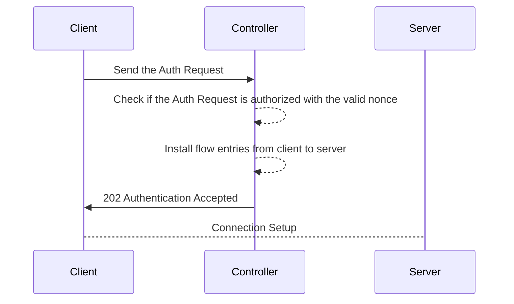

# [Lab Experience] SDN Security

## About the project

**BonsaiLab@Politecnico di Milano - 2021/2022**

Implementation of a Software Defined Perimeter (SDP) in Ryu manager: in order to access a service inside a network, a client must authenticate itself by sending an authentication request to the network controller. The authentication is based on a Hash-based Message Authentication Code (HMAC) computed using a pre-shared key. Sequential nonces are used in authentication requests to avoid replication. Once the authentication is successfull, the controller setup a connection between client and server on the shortest path.



The *sdnsec.ipynb* notebook is just a draft containing the code used for the SDP authentication part.

## Before running

Run create_conf.py at client (in \~/ folder) and controller side (\~/ryu/ryu/app/ folder).
The following parameters can be set:

- In *sec_controller.py*:
  - *self.flows_expire_in* (default = 30): expiration time (idle_timer) in seconds of the flows entries installed through authentication
  - *self.ctr_margin* (default = 5): nonce(counter) acceptance margin 
  - *self.controller_mac* (default = "4e:4e:4e:4e:4e:4e"): dummy MAC address of the controller
  - *self.controller_ip* (default = "10.0.0.100"): dummy IP address of the controller
  - *self.servers_ip* (default = ['10.0.0.2']): list of servers which can be reached through authentication
- The following conf_dict values in *create_conf.py*:
  - "controller_ip":  dummy IP address of the controller
    - "auth_port": UDP port where client address its Authentication Request
    - "master_key": master key from which are derived client and controller shared keys 
    - "next_ctr": next nonce to be used for a valid authentication request
- In *clientsec.py*:
  - max_nb_attempts (default = 5): maximum number of failed Auth Requests, can be increased up to 15 in case of non valid nonce
  - reception_timeout (default= 2): maximum waiting for the response
  - server_ip (default = '10.0.0.2'): IP address of the service for which client wants to request the connection
  - server_port (default = 22): destination port address of the service for which client wants to request the connection
  - conf_path = conf_path = ~/conf.json
  - transport_layer (default = 'tcp'): transport protocol that want to be used to communicate with the service

## Running on Mininet

1. Run Mininet with a topology of your choice (e.g. the one described in ~/TwoWayTopology.py) ```sudo mn --custom ~/TwoWayTopology.py --mac --topo mytopo --controller=remote,ip=127.0.0.1,port=6633 --switch ovs,protocols=OpenFlow13```
2. Run Ryu manager ```~/ryu/bin/ryu-manager --observe-links ~/ryu/ryu/app/sec_controller.py```
3. Send at least a packet from servers in order to trigger the MAC learning on controller (through a ping for example)
4. Open server terminal on server through ```xterm h2``` and run server application on it ```~/server.py```. Supposing h2 is the server host and *server.py* is placed in its home folder.
5. Open client terminal on client through ```xterm h1``` and run client application on it ```~/client_sec.py```. Supposing h2 is the server host and *client_sec.py* is placed in its home folder.

At the end of this process, a connection between client and server is setup if everything went correctly.


